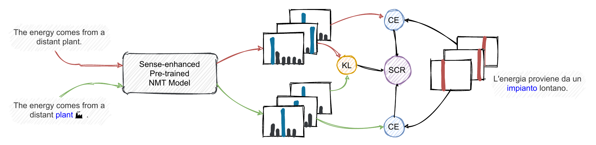

# Reducing Disambiguation Biases in NMT by Leveraging Explicit Sense Information



This repository contains code and instructions to train and evaluate models as described in the paper.

## Experiments folder structure
Every experiment is stored under the `experiments/` folder, in its own directory, divided by language pair and by experiment name. For example, the baseline model of English-German is found under `experiments/en-de/wmt/baseline`, while the model fine-tuned with SCR is found under `experiments/en-de/wmt/baseline+scr`.

This repository contains the translations, produced with the models described in the paper, of the various test sets we tested against (both for BLEU computation and for WSD bias evaluation).

<details>
<summary>Expand structure</summary>

```
experiments
├── en-de
│   └── wmt
│       ├── baseline
│       │   └── translations
│       │       │   ├── logs
│       │       │   ├── output
│       │       │   ├── en
│       │       │   ├── adv.en
│       │       │   ├── de
│       │       │   ├── pred.de
│       │       │   ├── pred.adv.de
│       │       │   └── pred.de.align
│       │       │   ├── pred.adv.de.align
│       │       ├── test_2014
│       │       │   ├── hyp
│       │       │   ├── ref
│       │       │   └── src
│       │       ├── test_2019
│       │       │   ├── hyp
│       │       │   ├── ref
│       │       │   └── src
│       │       └── wsd_bias
│       │           ├── logs
│       │           ├── output
│       │           ├── en
│       │           ├── de
│       │           ├── pred.de
│       │           └── pred.de.align
│       ├── baseline+scr
│       │   └── ...
│       ├── baseline+scr-noar
│       │   └── ...
│       ├── baseline+scr-noares
│       │   └── ...
│       └── baseline+scr-nokl
│           └── ...
├── en-es
│   └── wmt13
│       ├── baseline
│       │   └── translations
│       │       └── test
│       │           ├── hyp
│       │           ├── ref
│       │           └── src
│       └── ...
└── en-fr
    └── wmt14
        └── ...
```
</details>

## Data
All generated datasets are available [on the HuggingFace Hub](https://huggingface.co/datasets/Valahaar/wsdmt).

## Setup the environment

Requirements:
* Debian-based (e.g. Debian, Ubuntu, ...) system 
* [conda](https://docs.conda.io/en/latest/) installed

To quickly setup the environment to use ExtEnd/replicate our experiments, you can use the bash script `setup.sh`. The only requirements needed here is to have a Debian-based system (Debian, Ubuntu, ...) and [conda](https://docs.conda.io/en/latest/) installed.

```
bash setup.sh
```

## Training a model from scratch
```bash
PYTHONPATH=src python src/main.py \ 
  --src en \ 
  --tgt de \ 
  --experiment baseline \ 
  --virtual-batch-size 768 \ 
  --batch-size 4 \ 
  --gpus 1 \ 
  --no-pretraining \ 
  --lr 5e-4 \ 
  --corpus-name wmt \ 
  --max_steps 100000 \ 
  --warmup-steps 4000 \ 
  --smoothing 0.1 \ 
  --seed 1337 \ 
  --dataset-variety all \ 
  --encoder-type base 
```

## Fine-tuning a pre-trained model with SCR
```diff
PYTHONPATH=src python src/main.py \ 
  --src en \ 
  --tgt de \ 
+ --experiment baseline+cr \ 
  --virtual-batch-size 768 \ 
  --batch-size 4 \ 
  --gpus 1 \ 
  --no-pretraining \ 
  --lr 5e-4 \ 
  --corpus-name wmt \ 
  --max_steps 100000 \ 
  --warmup-steps 4000 \ 
  --smoothing 0.1 \ 
  --seed 1337 \ 
  --dataset-variety all \ 
+ --encoder-type sense \ 
+ --val_check_interval 0.25 \ 
+ --restart-from baseline \ 
+ --scr
```

## Translate a file using a trained model
```bash
PYTHONPATH=src python scripts/translate.py \ 
  --exp en-es/wmt13/baseline \ 
  --input /path/to/input.txt \ 
  > /path/to/output.txt
```

## Evaluating WSD bias

### DiBiMT
For DiBiMT, refer to the [official page](https://nlp.uniroma1.it/dibimt/).

### Emelin et al. Challenge Sets (English-German only)
First, unpack `wsd_bias.zip` inside the `data` folder (i.e., once unpacked, you should have a file at `data/wsd_bias/bn_sense_clusters.json`). Then, you should be able to simply run the following command:
```bash
python scripts/evaluate_model.py --exp en-de/wmt/baseline
```

Which will run the evaluation for the model under `experiments/en-de/wmt/baseline`. If there are no translated files under that directory, and there is a `best.ckpt`, the script will use that model to compute the translation before running the evaluation script. Be aware that it will also run `scripts/produce_alignments.py`, which requires `fast-align` to be installed in your system (you will have to replace the path to fast-align's build in the script itself).

For better understanding the WSD bias data, you can refer to the [original paper](https://aclanthology.org/2020.emnlp-main.616/) and the [associated GitHub repository](https://github.com/demelin/detecting_wsd_biases_for_nmt).

## Cite this work
```
@inproceedings{campolungo-etal-2022-reducing,
  title = "Reducing Disambiguation Biases in {NMT} by Leveraging Explicit Word Sense Information",
  author = "Campolungo, Niccol{\`o}  and
    Pasini, Tommaso  and
    Emelin, Denis  and
    Navigli, Roberto",
  booktitle = "Proceedings of the 2022 Conference of the North American Chapter of the Association for Computational Linguistics: Human Language Technologies",
  month = jul,
  year = "2022",
  address = "Seattle, United States",
  publisher = "Association for Computational Linguistics",
  url = "https://aclanthology.org/2022.naacl-main.355",
  pages = "4824--4838",
}
```

## Acknowledgements
The authors gratefully acknowledge the support of the ERC Consolidator Grant MOUSSE No. 726487 and the PerLIR project (Personal Linguistic resources in Information Retrieval) funded by the MIUR Progetti di ricerca di Rilevante Interesse Nazionale programme (PRIN 2017). This work was also partially supported by the MIUR under the grant “Dipartimenti di eccellenza 2018-2022" of the Department of Computer Science of Sapienza University.


## License
This work is under the [Attribution-NonCommercial-ShareAlike 4.0 International (CC BY-NC-SA 4.0) license](https://creativecommons.org/licenses/by-nc-sa/4.0/).
